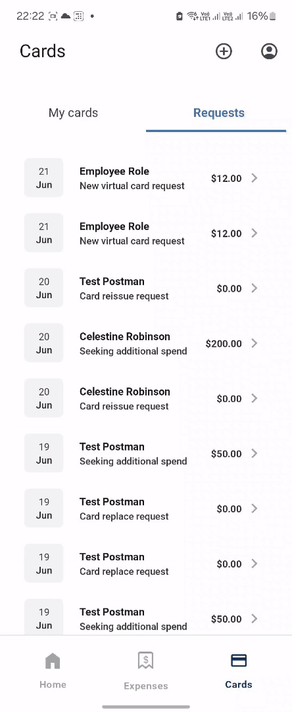

# Mobile Developer

### Technical Skills:
 - **UI** - Jetpack Compose, XML, Data/View Bindings, JavaScript, TypeScript, HTML, CSS
 - **Programming** - Java, Kotlin, Yaml, JavaScript, TypeScript, C++, Batch, Shell
 - **CI-CD** - GitHub Actions, GitLab, fastlane, Firebase, Play Console
 - **Implementation & Architectures** - SOLID principles, Test Driven Development(TDD), Reactive, Declarative, MVC, MVP, MVVM Clean
 - **Reactive** - Flows, RxJava, LiveData
 - **Concurrency** - Multithreading, Coroutines
 - **Database** - RoomDB, SQLite, Realm, Firebase-RTD
 - **Dependency-Injection** - Dagger-Hilt, Dagger 2, Koin
 - **Testing** - JUnit, Instrumentation, Mockito, Espresso
 - **Performance analytics** - Profiling for memory, storage, energy. Memory leaks removal
 - **Source control / Versioning** - Git, Github, SVN
 - **Devices** - Smartphones, Watches, Tablets, KIOSK, Point of Sale, Thermal Printers
 
# Portfolio
## **SpendLink**

Since we know how Credit Card expense statement / bill / report can take up to a month. Organizations who already did the expenditure, couldn't trace its progress status and this could lead to un-expected, non-required processes and delays. SpendLink was created considering real-time reports, with individual Expense and Card management in mind.

These images & videos demonstrate that the app has been refactored from XML, RxJava, MVVM, Java, Multi-Threading to Jetpack Compose, Flows (StateFlow and CallbackFlow majorly), MVVM Clean, Kotlin, Coroutines, TDD with Unit, Instrumentation and UI testing. Github-Actions for CI-CD.

  Login with Credentials   |   Login with Biometrics                            
:-------------------------:|:-------------------------:
 | 

  Landing   |   Dashboard                            
:----------:|:-------------:
 | 

  Expense Details   |   Cards                            
:------------------:|:--------:
 | 

  Create Expense   |   Create Card                            
:-----------------:|:--------------:
 | 

  White Labeling   |   Old App                            
:-----------------:|:----------:
 | 
